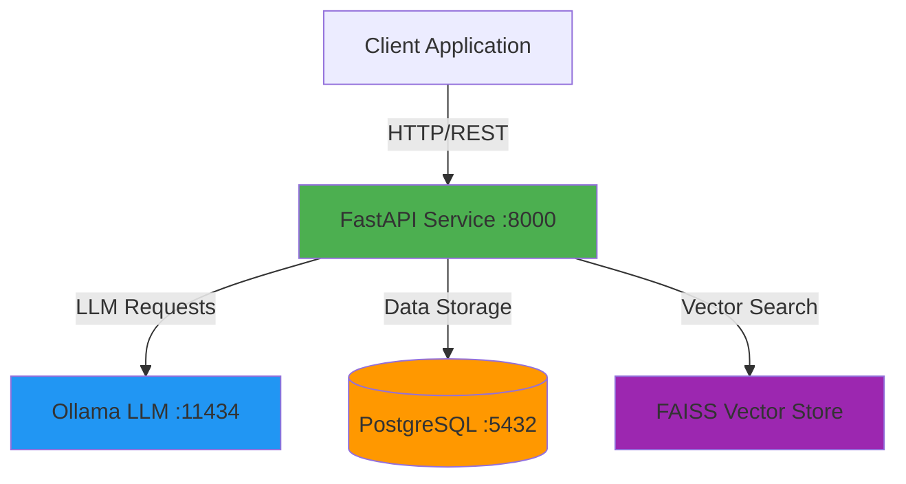

# LLM Service with Ollama

A production-ready FastAPI service that integrates with Ollama for large language model capabilities, featuring user authentication, chat history management, document embeddings, and vector-based similarity search using FAISS.

## Architecture



## Features

- **Authentication & Authorization**: JWT-based user authentication with secure password hashing
- **Chat Interface**: Interactive chat with Ollama LLM models with conversation history
- **Document Embeddings**: Generate and store embeddings for text documents
- **Vector Search**: FAISS-powered similarity search for semantic document retrieval
- **Database Persistence**: PostgreSQL database for users, chat history, and vector metadata
- **Docker Compose**: Fully containerized development and deployment environment

## Tech Stack

| Component | Technology |
|-----------|-----------|
| API Framework | FastAPI 0.115.12 |
| LLM Backend | Ollama |
| Database | PostgreSQL 15 |
| ORM | SQLModel 0.0.24 |
| Vector Search | FAISS (CPU) |
| Authentication | JWT (python-jose) |
| Password Hashing | bcrypt + passlib |
| Container Orchestration | Docker Compose |

## Project Structure

```
LLM-Service-Ollama/
├── api/
│   ├── core/
│   │   ├── config.py          # Configuration management
│   │   ├── database.py        # Database connection and session
│   │   └── security.py        # Authentication utilities
│   ├── models/
│   │   ├── user.py           # User data model
│   │   ├── history.py        # Chat history model
│   │   ├── vector.py         # Vector metadata model
│   │   └── embed.py          # Embedding model
│   ├── routers/
│   │   ├── auth.py           # Authentication endpoints
│   │   ├── chat.py           # Chat endpoints
│   │   ├── embedding.py      # Embedding generation endpoints
│   │   └── vector_store.py   # Vector search endpoints
│   ├── main.py               # Application entry point
│   ├── requirements.txt      # Python dependencies
│   └── Dockerfile            # API service container
├── compose.yaml              # Docker Compose configuration
└── ollama-data/              # Ollama model storage
```

## Prerequisites

- Docker Engine 20.10+
- Docker Compose 2.0+
- 8GB RAM minimum (16GB recommended for larger models)
- 10GB free disk space for models

## Quick Start

### 1. Clone the Repository

```bash
git clone <repository-url>
cd LLM-Service-Ollama
```

### 2. Configure Environment

The default configuration in `compose.yaml` includes:

```yaml
environment:
  - JWT_SECRET=your_jwt_secret_key_here  # Change in production
  - POSTGRES_PASSWORD=password           # Change in production
  - POSTGRES_USER=user
  - POSTGRES_DB=llm_service
```

**Security Note**: Update `JWT_SECRET` and `POSTGRES_PASSWORD` before deploying to production.

### 3. Start Services

```bash
docker compose up -d
```

This starts three services:
- **API**: `http://localhost:8000`
- **Ollama**: `http://localhost:11434`
- **PostgreSQL**: `localhost:5432`

### 4. Verify Installation

```bash
# Check service health
curl http://localhost:8000/health

# View API documentation
open http://localhost:8000/docs
```

## API Endpoints

### Authentication

| Method | Endpoint | Description |
|--------|----------|-------------|
| POST | `/auth/register` | Register new user |
| POST | `/auth/login` | Login and receive JWT token |

### Chat

| Method | Endpoint | Description |
|--------|----------|-------------|
| POST | `/chat` | Send message to LLM |
| GET | `/chat/history` | Retrieve chat history |

### Embeddings

| Method | Endpoint | Description |
|--------|----------|-------------|
| POST | `/embeddings` | Generate embeddings for text |
| POST | `/embeddings/batch` | Generate embeddings for multiple texts |

### Vector Store

| Method | Endpoint | Description |
|--------|----------|-------------|
| POST | `/vector/store` | Store document with embedding |
| POST | `/vector/search` | Search similar documents |
| GET | `/vector/list` | List stored vectors |

## Usage Examples

### Register and Authenticate

```bash
# Register a new user
curl -X POST http://localhost:8000/auth/register \
  -H "Content-Type: application/json" \
  -d '{
    "username": "john_doe",
    "email": "john@example.com",
    "password": "secure_password"
  }'

# Login to get JWT token
curl -X POST http://localhost:8000/auth/login \
  -H "Content-Type: application/json" \
  -d '{
    "username": "john_doe",
    "password": "secure_password"
  }'
```

### Chat with LLM

```bash
# Send a chat message (replace <TOKEN> with your JWT)
curl -X POST http://localhost:8000/chat \
  -H "Authorization: Bearer <TOKEN>" \
  -H "Content-Type: application/json" \
  -d '{
    "message": "What is the capital of France?",
    "model": "llama2"
  }'
```

### Generate Embeddings

```bash
# Generate embedding for text
curl -X POST http://localhost:8000/embeddings \
  -H "Authorization: Bearer <TOKEN>" \
  -H "Content-Type: application/json" \
  -d '{
    "text": "Machine learning is a subset of artificial intelligence",
    "model": "llama2"
  }'
```

### Vector Search

```bash
# Store a document
curl -X POST http://localhost:8000/vector/store \
  -H "Authorization: Bearer <TOKEN>" \
  -H "Content-Type: application/json" \
  -d '{
    "text": "FastAPI is a modern web framework for Python",
    "metadata": {"category": "technology", "source": "documentation"}
  }'

# Search for similar documents
curl -X POST http://localhost:8000/vector/search \
  -H "Authorization: Bearer <TOKEN>" \
  -H "Content-Type: application/json" \
  -d '{
    "query": "What is FastAPI?",
    "top_k": 5
  }'
```

## Development

### Local Development with Hot Reload

```bash
# Start services with file watching
docker compose watch
```

Changes to files in `./api` will automatically sync to the container.

### Access Database

```bash
# Connect to PostgreSQL
docker compose exec db psql -U user -d llm_service
```

### View Logs

```bash
# All services
docker compose logs -f

# Specific service
docker compose logs -f api
docker compose logs -f ollama
```

### Run Tests

```bash
# Execute tests inside API container
docker compose exec api pytest
```

## Configuration

### Environment Variables

| Variable | Description | Default |
|----------|-------------|---------|
| `JWT_SECRET` | Secret key for JWT signing | `your_jwt_secret_key_here` |
| `POSTGRES_USER` | Database username | `user` |
| `POSTGRES_PASSWORD` | Database password | `password` |
| `POSTGRES_DB` | Database name | `llm_service` |
| `POSTGRES_SERVER` | Database host | `db` |
| `POSTGRES_PORT` | Database port | `5432` |

### Ollama Models

Pull additional models:

```bash
# List available models
docker compose exec ollama ollama list

# Pull a specific model
docker compose exec ollama ollama pull llama2
docker compose exec ollama ollama pull mistral
docker compose exec ollama ollama pull codellama
```

## Troubleshooting

### Service Won't Start

```bash
# Check service status
docker compose ps

# Restart services
docker compose restart

# Rebuild containers
docker compose up --build -d
```

### Database Connection Issues

```bash
# Verify database is running
docker compose exec db pg_isready

# Check database logs
docker compose logs db
```

### Ollama Model Issues

```bash
# Verify Ollama is running
curl http://localhost:11434/api/tags

# Check Ollama logs
docker compose logs ollama
```

## Production Deployment

### Security Checklist

- [ ] Change `JWT_SECRET` to a strong random value
- [ ] Update database credentials
- [ ] Enable HTTPS/TLS
- [ ] Configure firewall rules
- [ ] Set up rate limiting
- [ ] Enable CORS with specific origins
- [ ] Implement request validation
- [ ] Set up monitoring and logging

### Performance Optimization

- Use persistent volumes for database
- Configure PostgreSQL connection pooling
- Use GPU-enabled Ollama image for better performance
- Implement caching for frequent queries
- Set resource limits in Docker Compose

### Backup Strategy

```bash
# Backup database
docker compose exec db pg_dump -U user llm_service > backup.sql

# Restore database
docker compose exec -T db psql -U user llm_service < backup.sql
```

## API Documentation

Interactive API documentation is available at:
- **Swagger UI**: `http://localhost:8000/docs`
- **ReDoc**: `http://localhost:8000/redoc`

## Contributing

Contributions are welcome. Please ensure code quality standards are met:

```bash
# Install pre-commit hooks
pre-commit install

# Run linting
ruff check api/

# Run type checking
mypy api/
```

## License

This project is provided as-is for educational and commercial use.

## Support

For issues, questions, or contributions, please open an issue on the repository.

---

**Built with FastAPI, Ollama, and PostgreSQL**
